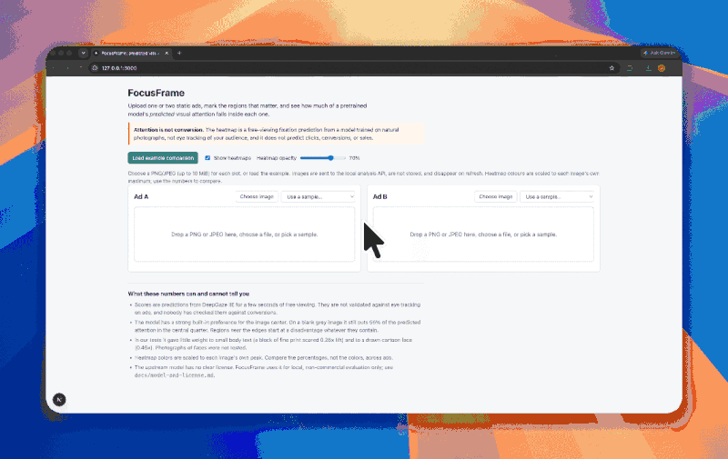
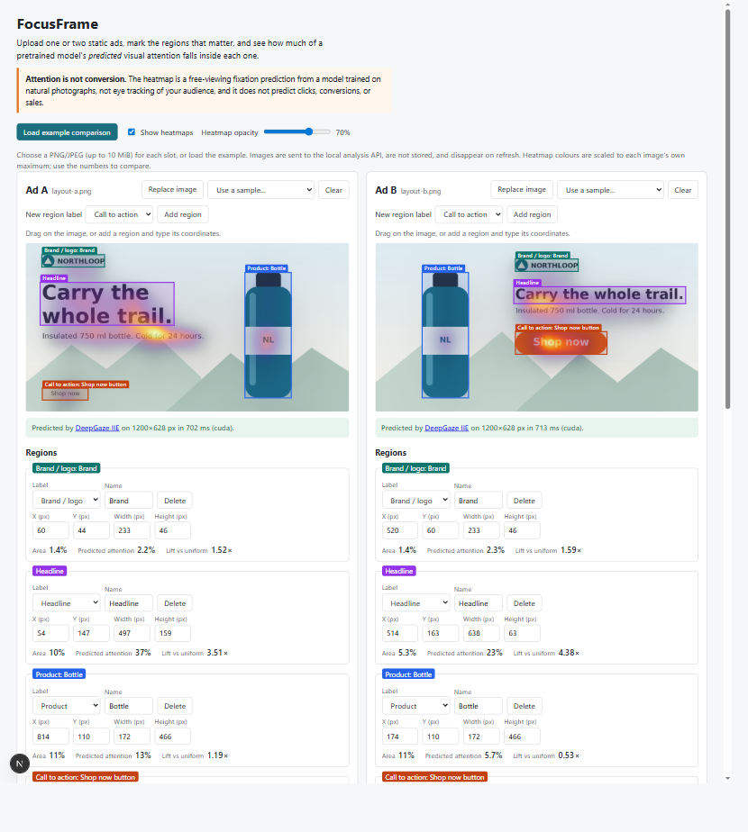
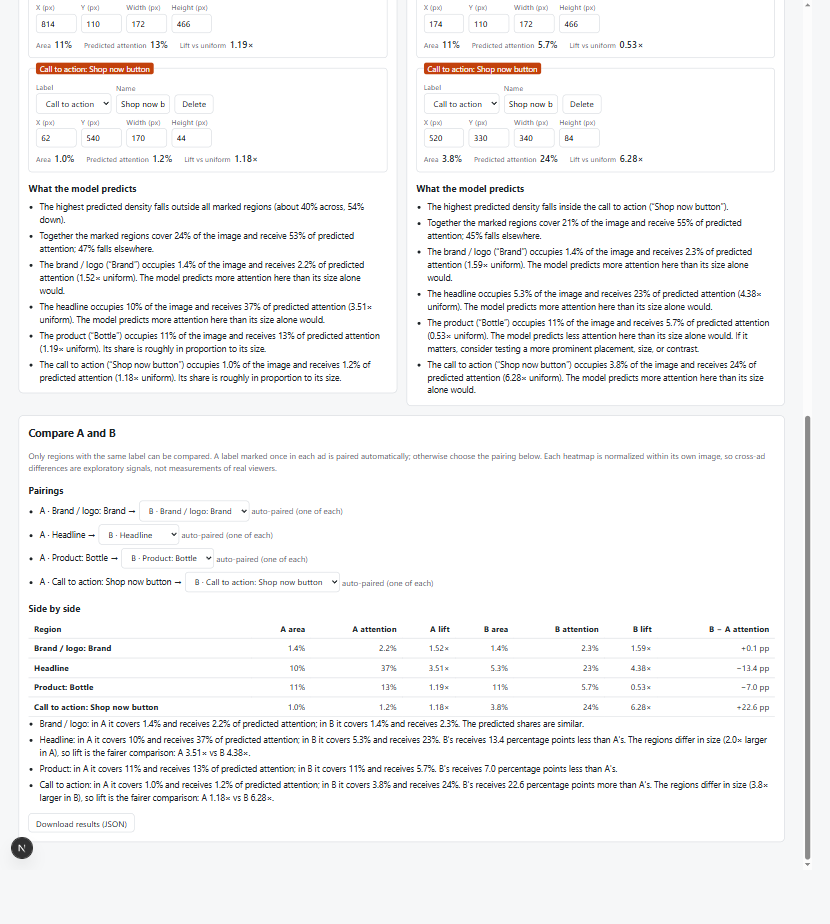
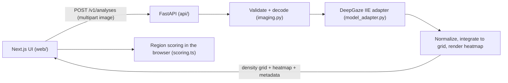

# FocusFrame

FocusFrame shows where a pretrained eye-movement model predicts people will look in a static ad.

- Upload one or two PNG or JPEG ads, or load the bundled examples.
- Mark the brand, headline, product, and call to action.
- See what share of the model's predicted attention falls inside each region, and how explicitly paired regions compare between two layouts.



[Watch the full demo](https://youtu.be/16WNrcHl-Rc).



**Highlights**

- A full-stack app with a Next.js/TypeScript frontend and a FastAPI/PyTorch backend. The two share one typed API contract, generated from Pydantic, and tests fail if it drifts.
- Real model inference: a pinned, checksum-verified DeepGaze IIE, deterministic on both CPU and GPU. It returns a numeric density grid that the browser scores. Scores never come from heatmap colors.
- Region scoring uses fractional-overlap math and normalized coordinates, so scores stay the same at any display size. Regions can be drawn with the pointer or entered as accessible numeric inputs.
- Uploads are hardened: magic-byte checks, decompression-bomb limits, and EXIF handling. Nothing is stored, and errors are typed.
- An honest evaluation: a reproducible benchmark script, measured latency and memory, and documented failure cases, with no accuracy claims.



## What the model predicts, and what it does not

FocusFrame runs **DeepGaze IIE**, a published model of where people fixate during a few seconds of free viewing, trained on eye tracking over natural photographs. For each image it returns a probability density whose values sum to 1 over the image.

It does **not** predict clicks, conversions, sales, recall, or whether text is read or understood. It was not trained on ads, and this project has not validated it against eye tracking on ads or against campaign results. **Attention is not conversion.** Use the scores to raise design questions worth testing with people, not to choose a winner. [docs/evaluation.md](docs/evaluation.md) lists measured cases where the model's behavior should not be trusted.

## Quick start

**Prerequisites:**

- Python 3.10 or later. The recorded environment is 3.10.7 on Windows.
- Node.js 20 or later.
- Disk space: 0.9 GB for the model and backbone weights, plus about 5 GB for the CUDA PyTorch virtualenv. A CPU-only install is much smaller.
- An NVIDIA GPU is optional. The CPU works too, at about 1.3 s per 1200×628 ad on a Ryzen 5 5600X.

### Analysis API (`api/`)

```powershell
cd api
python -m venv .venv
.venv\Scripts\activate                      # macOS/Linux: source .venv/bin/activate
pip install -r requirements.lock.txt        # CUDA 12.6 wheels; for CPU-only see the header of that file
pip install --no-deps -e .
python -m focusframe_api.fetch_weights      # downloads and SHA-256-verifies the pinned weights
uvicorn focusframe_api.main:app --host 127.0.0.1 --port 8000
```

`GET http://127.0.0.1:8000/health` returns `{"status":"ok","model_ready":true}` once the model has loaded, which takes a few seconds after startup. Until then, analysis requests return `503`.

### Web app (`web/`)

```powershell
cd web
npm install
npm run dev                                  # http://localhost:3000
```

### Environment variables

| Variable | Default | Purpose |
| --- | --- | --- |
| `FOCUSFRAME_MODEL_CACHE` | `api/.model-cache` | Where weights and the torch hub cache are stored (git-ignored) |
| `FOCUSFRAME_DEVICE` | `auto` | `auto`, `cuda`, or `cpu` |
| `FOCUSFRAME_CORS_ORIGINS` | `http://localhost:3000,http://127.0.0.1:3000` | Comma-separated allowed browser origins |
| `FOCUSFRAME_GRID_MAX_SIDE` | `128` | Cells on the long side of the returned density grid |
| `NEXT_PUBLIC_API_BASE_URL` | `http://127.0.0.1:8000` | API URL used by the web app |

## Sample workflow

1. Open http://localhost:3000 and click **Load example comparison**. Two synthetic layouts for a fictional brand load, with their brand, headline, bottle, and CTA regions already marked. The images are in `web/public/samples/`, and `samples/generate_samples.py` regenerates them together with the exact region boxes.
2. Toggle **Show heatmaps** and adjust the opacity.
3. Drag on an image to draw a region, or click **Add region** and type pixel coordinates. Every region can be edited by number or deleted.
4. Read the comparison table:
   - Regions with a label used once in each ad are paired automatically.
   - Duplicate labels ask you to choose a pair.
   - Unmatched regions are listed as not compared.
5. Click **Download JSON** to save the regions, scores, pairs, and model version. No image data is included.

## Architecture



- **API:** one synchronous endpoint. Uploads are read into memory, analyzed, and discarded, never stored or logged. CORS is restricted to the configured origins.
- **Validation:**
  - Allowed MIME type, checked against the file's magic bytes.
  - At most 10 MiB and 20 MP, with at least 32 px on each side and an aspect ratio no more extreme than 8.5:1.
  - Decompression-bomb protection; animated images are rejected.
  - EXIF orientation is applied once, and transparency is composited over white.
- **Model adapter:** all model-specific code is in `api/focusframe_api/model_adapter.py`. The input is rescaled so the long side is 1024 px, and the MIT1003 center bias is applied as the upstream README describes. Inference is deterministic.
- **Contract:** the Pydantic schemas in `api/focusframe_api/schemas.py` produce `contract/openapi.json`, and that file produces `web/src/lib/api/schema.gen.ts`. Tests fail if either output drifts.
- **Response:**
  - `schema_version` and `model` (name, pinned version, weights hash, source, citation, license note).
  - `image` (post-EXIF size).
  - `density`: a base64 float32 little-endian grid, row-major from the top-left, 128 cells on the long side, summing to 1.
  - `heatmap`: a PNG data URL whose colors are relative to the image's own peak.
  - `processing`: every preprocessing choice and the timings.
- **Errors:** `400`, `413`, `415`, `422`, `500`, and `503`, each as `{code, message, request_id}` with no internals.

Design decisions and how they changed from the original brief are recorded in [docs/decisions.md](docs/decisions.md).

## Model attribution and license

DeepGaze IIE, from [matthias-k/DeepGaze](https://github.com/matthias-k/DeepGaze), is pinned to commit `c7db17e2` with weights `deepgaze2e.pth` (SHA-256 `49b65724…`).

> Linardos, A., Kümmerer, M., Press, O., & Bethge, M. (2021). Calibrated prediction in and out-of-domain for state-of-the-art saliency modeling. [arXiv:2105.12441](https://arxiv.org/abs/2105.12441)

**The upstream repository declares no license.** There is no LICENSE file, and the MIT entry in its `setup.py` is commented out. FocusFrame therefore uses the model only for local, non-commercial evaluation and does not redistribute the weights; `fetch_weights` downloads them from the upstream release. It is not cleared for commercial use. Details are in [docs/model-and-license.md](docs/model-and-license.md).

## How scoring works

Regions are stored normalized to `[0,1]`, so resizing the browser does not move them. For a rectangle \(R\) over the density grid \(p\), where \(p\) sums to 1:

- **attention mass** \(= \sum_{cells} p_{cell} \cdot \text{overlap}(cell, R) / \text{area}(cell)\). Cells cut by the rectangle edge count in proportion to how much of them it covers.
- **area share** \(= \text{width} \times \text{height}\), as a fraction of the image.
- **lift** \(=\) attention mass / area share. A lift of 1 means the region gets exactly its size's worth of attention.

Scores are never derived from heatmap colors. Overlapping regions can sum to more than 100%, and the UI says so when that happens.

**Worked example:** layout B's CTA is 340×84 px at (520, 330) in a 1200×628 ad.

- Area share = 28,560 / 753,600 = **3.79%**.
- The grid cells it covers hold **23.8%** of predicted attention.
- Lift = 23.8 / 3.79 = **6.28×**.

Layout A's corner CTA covers 1.0% and gets 1.2%, a lift of 1.18×. The explanation turns this into a question to test ("consider testing a more prominent placement"), not a verdict.

## Verification

```powershell
# API: unit, contract, and API tests plus a real-model integration test (skipped if weights are missing)
cd api; .venv\Scripts\python -m pytest; .venv\Scripts\ruff check .; .venv\Scripts\mypy focusframe_api
# Web: math/pairing/explanation tests, types, lint, contract drift, production build
cd web; npm test; npm run typecheck; npm run lint; npm run check:api; npm run build
# Offline evaluation (writes docs/evaluation/results.json and figures)
api\.venv\Scripts\python api\scripts\evaluate.py
```

**Measured on a Ryzen 5 5600X with an RTX 3060** (full tables in [docs/evaluation.md](docs/evaluation.md)):

- **Speed:** a 1200×628 ad takes 0.55 s on the GPU and 1.33 s on the CPU. A 20 MP JPEG takes about 1.06 s end to end on the GPU.
- **Response size:** about 129 KiB per analysis.
- **Reproducibility:** repeat runs are bit-identical, and CPU and GPU scores agree within 0.006 percentage points.

**Findings to keep in mind:**

- There is a strong center prior: a blank image still puts 55% of attention in the central quarter.
- On featureless images there is a spurious hot band along the bottom edge.
- Fine print and a drawn face are largely ignored.
- Mirroring, padding, or resizing the same ad moved a region's share by up to 1.85 percentage points, so smaller differences are reported as "no clear difference".

## Limitations

- The license is unclear, so the tool is for non-commercial use only.
- There was no validation against ad eye tracking or conversions.
- The model was trained on natural photos viewed centered on a monitor, not on ads in feeds or on phones.
- Heatmap colors are relative to each image, so compare percentages, not colors.
- Only two synthetic samples are included.
- GPU inference is serialized, so concurrent requests queue.
- Regions are manual rectangles only.
- The browser analyses are lost on refresh.

## License

The FocusFrame code is released under the [MIT License](LICENSE). That license does not extend to DeepGaze IIE or its weights; see [Model attribution and license](#model-attribution-and-license).

## Planned improvements and deployment notes

- Validate on licensed ads with public fixation data, against a center-bias-only baseline, before making any claims about ads.
- Show framing sensitivity (crop, padding) next to each comparison.
- Add persistence (object storage plus PostgreSQL) and a job queue only when they are needed. Retention and deletion policies should come first.
- **Deployment:**
  - Set `FOCUSFRAME_CORS_ORIGINS` to the deployed web origin and `NEXT_PUBLIC_API_BASE_URL` to the API.
  - Put the API behind a reverse proxy that enforces the upload size limit.
  - Pre-fetch the weights into the image or volume.
  - Resolve the model license first.
