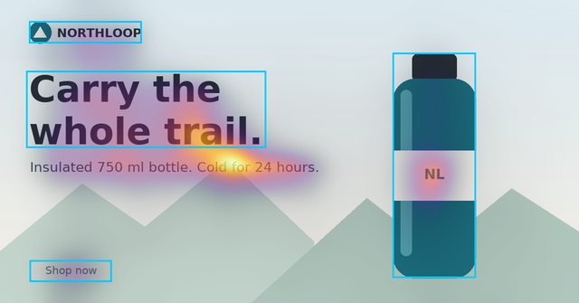
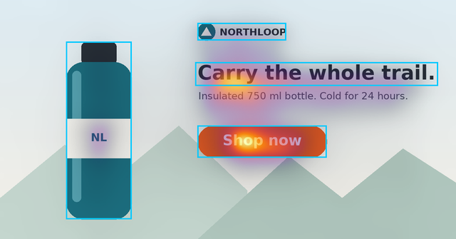
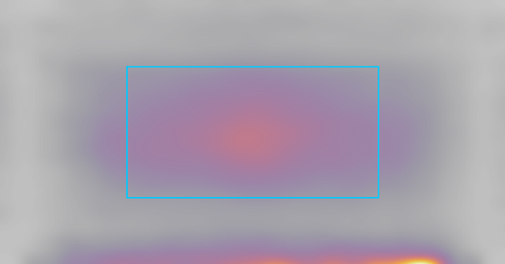
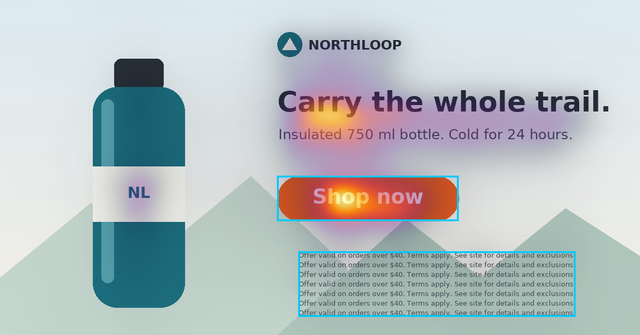
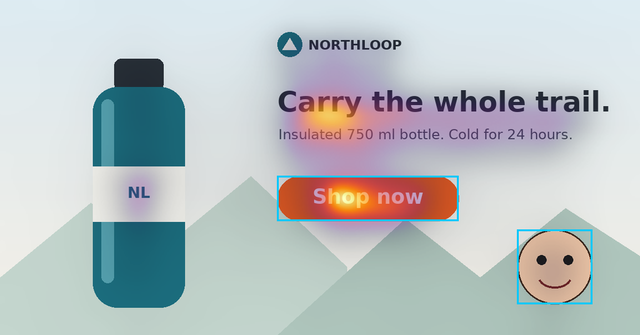

# Evaluation report

This report covers **technical checks only**. It measures whether the integration is correct, reproducible, and fast enough, and it shows where the model behaves in ways a designer should distrust. **It does not measure accuracy.** There was no comparison with eye-tracking fixations on ads and no comparison with click or conversion data, so nothing here shows that the predictions are right for advertising.

Every number below comes from one run of `api/scripts/evaluate.py` on 2026-09-28. The raw output is [`evaluation/results.json`](evaluation/results.json). To reproduce it:

```powershell
api\.venv\Scripts\python api\scripts\evaluate.py   # about 100 s with a GPU
```

In each figure, the model's heatmap is drawn over the image and the scored regions are outlined in cyan. Colors are scaled to each image's own peak.

## Setup

| | |
| --- | --- |
| Dataset | 2 project-generated synthetic ads, 1200×628 (`web/public/samples/`), plus 5 variants derived in the script: mirrored, letterboxed to square, downscaled to 300 px, fine print added, cartoon face added. A blank grey image is also included. All are owned by the project; see ADR-008. They were viewed as standalone images, not in a feed or on a device. |
| Model | DeepGaze IIE, `deepgaze_pytorch@c7db17e2+deepgaze2e.pth:sha256-49b65724184f`. Input is rescaled so the long side is 1024 px (Lanczos), with the MIT1003 center bias zoomed to the input size. |
| Hardware | Windows 10, Python 3.10.7, torch 2.7.1+cu126. AMD Ryzen 5 5600X (6 torch threads), NVIDIA RTX 3060 12 GB, 32 GB RAM. |

## Density normalization and reproducibility

These checks ran on both samples, with the same result each time.

| Check | Result |
| --- | --- |
| Finite and nonnegative | yes |
| Full-resolution density (1024×536) sum − 1 | −1.1e-16 |
| float32 grid (128×67) sum − 1 | −5.5e-10 (A), −2.2e-10 (B) |
| Same image twice, GPU | bit-identical (max abs diff 0) |
| Same image twice, CPU | bit-identical (max abs diff 0) |
| GPU vs CPU | correlation 1.0000, max relative pixel diff 6.5e-4, max region-score diff 0.006 percentage points |
| Grid (128 long side) vs full-resolution region scores | max diff 0.063 percentage points |
| Peak / mean density | 14.6 (A), 18.6 (B) |
| Entropy relative to uniform | 0.904 (A), 0.885 (B) |
| Correlation between A's and B's density maps | −0.016 (different layouts give different maps) |

The Python scoring in the evaluation script and the TypeScript scoring in the browser were implemented separately. They agree on every sample region. For example, B's CTA scores 23.8% of attention at 6.28× lift in both. The unit tests cover uniform grids, edges, straddling cells, overlap, and resize invariance (`web/src/lib/*.test.ts`, `api/tests/test_density.py`).

## Runtime, memory, and payload

Each size is the layout-B ad resized to those dimensions. Content is stretched where the aspect ratio differs, so these rows measure speed and size, not score behavior. Inference times are medians: 5 runs on the GPU and 2 on the CPU, each after a warm-up. The end-to-end figure is the median of 3 `POST /v1/analyses` calls through the ASGI app on the GPU. It includes decoding, EXIF handling, heatmap rendering, and JSON encoding, but not network time.

| Input | Model input | GPU inference | CPU inference | API end to end (GPU) | Peak CUDA allocated | Response (heatmap + grid) |
| --- | --- | --- | --- | --- | --- | --- |
| 300×250 PNG | 1024×853 | 749 ms | 1978 ms | 911 ms | 776 MiB | 177 KiB (105 + 71) |
| 728×90 PNG | 1024×127 | 321 ms | 509 ms | 345 ms | 474 MiB | 47 KiB (35 + 11) |
| 1200×628 PNG | 1024×536 | 550 ms | 1329 ms | 648 ms | 646 MiB | 129 KiB (83 + 45) |
| 1080×1080 PNG | 1024×1024 | 852 ms | 2490 ms | 1030 ms | 845 MiB | 193 KiB (106 + 85) |
| 1080×1920 PNG | 576×1024 | 561 ms | 1449 ms | 679 ms | 661 MiB | 124 KiB (74 + 48) |
| 4000×5000 JPEG (20 MP) | 819×1024 | 729 ms | 1930 ms | 1058 ms | 763 MiB | 166 KiB (97 + 68) |

Other measurements:

- **Timing depends on the model input size, not the upload size.** Small ads are upscaled to a 1024 px long side, so a 300×250 banner costs more than a 1200×628 one.
- **Model load:** 2.0–4.3 s from the local cache. The first run took about 24 s because upstream code downloads the backbones.
- **Memory:** the running API server (GPU, model loaded, after the browser walkthrough) had a 1.41 GB working set. The evaluation process held both a CPU and a GPU copy of the model and peaked at 2.8 GB RSS.
- **Not measured:** intended hosting hardware (none is chosen), concurrent load, and cold-start memory on a CPU-only machine.

## Region scores on the samples

| Region | A area | A attention | A lift | B area | B attention | B lift |
| --- | --- | --- | --- | --- | --- | --- |
| Brand | 1.4% | 2.2% | 1.52× | 1.4% | 2.3% | 1.59× |
| Headline | 10.5% | 36.8% | 3.51× | 5.3% | 23.4% | 4.38× |
| Product (bottle) | 10.6% | 12.7% | 1.19× | 10.6% | 5.7% | 0.53× |
| CTA | 1.0% | 1.2% | 1.18× | 3.8% | 23.8% | 6.28× |

## Robustness probes

| Probe | Measured |
| --- | --- |
| Horizontal mirror of B (density mirrored back) | correlation 0.981 with the original; CTA attention 23.8% → 25.3% |
| B letterboxed into a 1200×1200 white square | 99.2% of attention stays on the ad band. Within the ad, CTA 23.8% → 22.0% and headline 23.4% → 24.9%. The ranking flips from CTA ≥ headline to headline > CTA. |
| B downscaled to 300×157, then analyzed (the model upscales it) | CTA 23.8% → 22.8%, headline 23.4% → 24.8%, brand 2.3% → 2.8%, product 5.7% → 5.4% |
| B with a 7-line fine-print block added (8.4% of area) | fine print: 2.2% attention, 0.26× lift; CTA unchanged (23.7%) |
| B with a drawn cartoon face added (2.6% of area) | face: 1.2% attention, 0.46× lift; CTA unchanged (23.7%) |
| Blank grey 1200×628 image | central quarter 54.9% of attention; CTA-sized box in the bottom-left corner 0.32× lift; 12.5% of attention in the bottom 5% of rows; peak at (83%, 99.7%) |

## Cases

### Useful 1: CTA prominence (A vs B)

 

- Layout A's small grey corner CTA gets 1.2% of predicted attention, at about its area share (1.18×).
- Layout B's large orange CTA, placed beside the headline, gets 23.8% (6.28×).
- Mirroring, letterboxing, and a 4× downscale each move B's CTA score by less than 2 percentage points. The 22-point gap between A and B is far larger than any change these perturbations caused.

This is the kind of question the tool is built for: "Does the CTA stand out in this layout?"

### Useful 2: an unmarked element takes the peak

In layout A, the density peak is not in any marked region. It falls on the sub-headline ("Insulated 750 ml bottle…"), at about 40% across and 54% down. The explanation panel reports this ("The highest predicted density falls outside all marked regions (about 40% across, 54% down)"). It prompts a designer to ask whether that line should be marked or de-emphasized, which the four preset regions alone would not reveal.

### Useful 3: results are reproducible and hardware-independent

Repeated runs are bit-identical, and CPU and GPU agree within 0.006 percentage points on every region. A score recorded with its `model.version` can be regenerated and compared later on different hardware. That is a prerequisite for any future validation study.

### Failure/uncertainty 1: center prior and an edge artifact



On an image with no content at all:

- The model still puts 54.9% of attention in the central quarter.
- A corner region starts at 0.32× lift.
- A hot band appears along the bottom edge, with 12.5% of mass in the bottom 5% of rows and the peak at 99.7% down.

The central preference comes from the MIT1003 center bias and learned priors, which reflect photos viewed centered on a monitor. It penalizes corner CTAs like A's, whatever their design. The bottom-edge band has no counterpart in the image. It is probably a boundary effect of the backbones, and it can inflate regions along the bottom edge on sparse, flat ads.

### Failure/uncertainty 2: fine print and a drawn face are nearly ignored

 

- The fine-print block covers 8.4% of the ad but gets 2.2% of attention (0.26×).
- The cartoon face gets 0.46×.

Photographic faces are known to attract strong predicted attention in DeepGaze models. This drawn face is not treated that way, and the samples contain no photographs to check the difference. Both results may match a few seconds of free viewing, but the model says nothing about *reading*. It cannot tell whether legally required copy is noticed.

### Failure/uncertainty 3: rankings between close regions depend on framing

In layout B, the headline (23.4%) and the CTA (23.8%) are nearly tied. Letterboxing the same ad into a square reverses their order (24.9% vs 22.0%). Downscaling it also changes their order.

**Conclusion:** differences of a few percentage points are within what framing alone can shift. They should not be read as a ranking.

- Across the three reframings, the largest change in any single region's share was 1.85 percentage points (B's CTA when letterboxed).
- The headline-vs-CTA gap within one ad moved by 3.3 points, from +0.4 to −2.9.
- Because of this, pair explanations now label same-label differences under 2 percentage points as "no clear difference" (`FRAMING_PP` in `web/src/lib/explain.ts`).

A related case: B's bottle covers 10.6% of the ad but gets 0.53× lift, because attention concentrates on its label rather than the whole shape. A product region's score depends heavily on how tightly it is drawn.

## Limitations

- **Domain shift:** the model was trained on eye tracking over natural photographs. All test images here are flat synthetic graphics. Nothing was validated on real ads.
- **Viewing context:** predictions assume a free-viewing image centered on a screen. A feed, a phone, a sidebar placement, or a short exposure would change real attention, and the model does not model any of these.
- **Resizing and center bias:** every input is rescaled to a 1024 px long side. The center prior, and the edge artifact on sparse images, favor some regions for reasons unrelated to the design.
- **Attention is not comprehension or action:** a high-attention CTA is not shown to be understood, clicked, or persuasive.
- **No validation:** there was no fixation benchmark on ads and no A/B or conversion comparison.
- **Samples and hardware:** only two base samples on one machine. Hosting hardware was not tested.

## Conclusions

**What it helps a designer inspect:**

- Whether a key element, such as the CTA, headline, or brand, gets a larger or smaller share of predicted early attention than its size alone would suggest.
- Whether something unmarked is drawing the peak.
- Whether a large layout change, like A vs B, moves those shares a lot.

**What it cannot infer:**

- Effectiveness, clicks, conversions, or reading.
- Behavior in a feed or on a device.
- Small ranking differences, since framing alone moves scores by several percentage points.

**Next experiment:**

1. Collect a small set of real, licensed ads with public eye-tracking fixation maps.
2. Report a standard fixation metric (for example, NSS or information gain) against a center-bias-only baseline.
3. Measure how often the ranking of paired regions agrees with the observed fixations.
4. Separately, add a letterbox and crop sensitivity readout to the UI so users can see how stable a comparison is.
